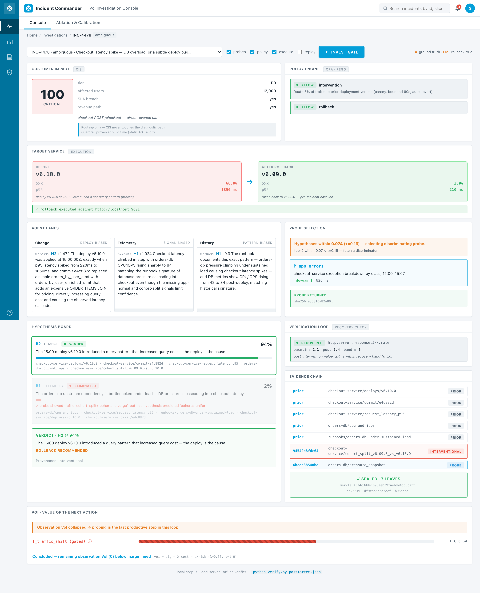
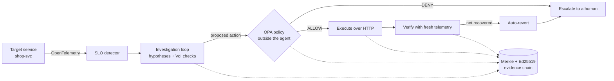

<div align="center">

# Incident Commander

**An autonomous SRE agent that decides when *not* to act.**

[](https://doi.org/10.5281/zenodo.23276215)

Bayesian belief updating for probe selection · OPA policy engine outside the agent · Merkle-signed evidence chain · offline-verifiable postmortems.

[Quickstart](#quickstart) · [What it does](#what-it-does) · [How it works](#how-the-mechanism-works) · [Architecture](#architecture) · [API](#api) · [Security](#security) · [Deployment](#deployment) · [Roadmap](#roadmap)

</div>



<sub>An ambiguous incident (database overload, or a subtle deploy bug?). The agent runs one discriminating check, OPA allows a bounded rollback, verification confirms recovery, and the decision trail is sealed.</sub>

---

## What it does

Incident Commander is a decision layer above your observability stack. It watches telemetry from a target service, opens an incident autonomously when SLOs are breached, and runs a formal loop to decide what to do next:

1. **Investigate** — competing root-cause hypotheses, scored by expected information gain per unit cost
2. **Ask** — a policy engine outside the agent decides whether the proposed action is allowed
3. **Act** — only after policy approval, over real HTTP against the target service
4. **Verify** — from fresh telemetry collected *after* the action, not the pre-action signal
5. **Auto-revert** — if verification fails, the agent undoes its own change
6. **Seal** — every decision is a leaf in a Merkle tree, signed with Ed25519, offline-verifiable

The condition for autonomy is **reversibility, not confidence**. Irreversible actions never run.

## Why

Most AI SRE tools show an agent fixing something. This project shows an agent **refusing to act** when the proposed action is unsafe — and proving it was right to refuse.

Enterprise DevOps teams cannot deploy autonomous incident response until three things are true simultaneously:
- The agent can act on the same interfaces production actually exposes (HTTP + OpenTelemetry)
- Every action is gated by a policy the agent cannot bypass
- Every decision produces a receipt a third party can verify without trusting the operator

Incident Commander shows all three end-to-end.

### Status and intended use

A working **research prototype**. It is the basis of our ongoing research on decision-theoretic incident response. The intended users are SRE and platform teams, starting in staging and read-only "shadow" mode in production: the agent earns more autonomy one reversible action at a time. It is not yet hardened for production; see [Security](#security).

## Quickstart

**Requirements:** Docker Desktop, Python 3.11+, Node 18+.

```bash
git clone https://github.com/S2800-0/incident-commander.git
cd incident-commander
pip install -e .
```

Then double-click `start.command` from Finder (macOS), or run:

```bash
./start.command
```

This launches, each in its own Terminal tab:

- OPA policy engine (Docker container, port 8181)
- Backend orchestrator + SLO detector (FastAPI on port 8000)
- Target service — the mock `shop-svc` (FastAPI on port 9001)
- Console (React + Vite on port 5173)

The console opens automatically in your browser. On the **Live** tab, click **▶ Start traffic (60 rps)**, then click any fault-injection scenario to watch the pipeline fire.

To stop everything cleanly: `./stop.command`.

## Try it

Once the console is open, four chaos scenarios exercise the four outcome patterns:

| Scenario | Expected outcome | What it proves |
|---|---|---|
| **Bad code release** | Autonomous rollback → verified recovery | Reversible actions execute end-to-end |
| **Config release + hidden dependency** | Rollback → verification fails → auto-revert → escalate | The system undoes its own action when the fix doesn't hold |
| **Two dependencies degrade together** | Abstain → escalate | Refusing when evidence cannot separate causes is a designed output |
| **orders-db saturation** | Failover proposed → **OPA DENY** → escalate | Irreversible actions are denied before they can execute |

Each scenario completes in 15-30 seconds. Between runs, click **⟲ Reset environment**.

## How the mechanism works

### Bayesian belief updating

Each hypothesis about the root cause carries a probability. When a probe returns evidence, the system compares the observation against what each hypothesis predicted:

- Predictions that matched → posterior probability **up**
- Predictions that mismatched → hypothesis **eliminated**

There is no learned model — the policy is deterministic Bayesian updating over structured hypothesis predictions. Same input, same output. Anyone can audit the logic by reading the code.

### Value-of-Information probe selection

Not every check is worth running. The system scores each candidate probe by expected information gain divided by cost, and picks the argmax over probes that haven't run yet. The stop rule is: continue while uncertainty remains **and** a discriminating check still exists.

```
next_check = argmax( expected_information_gain / cost )
```

Zero LLM tokens in the decision path.

### Policy-as-code outside the agent

Every state-changing action is gated by an [OPA](https://www.openpolicyagent.org/) engine running in its own Docker container, on its own port, with policies written in Rego. The backend calls OPA over HTTP with a policy input document. The agent has no code path to write or bypass these rules; if OPA is unreachable, the backend fails closed.

Three action classes exist: rollback, canary, and intervention. Each is gated by different envelope constraints (blast radius, reversibility, traffic percentage, duration).

### Merkle + Ed25519 evidence chain

Every decision — SLO breach, probe result, policy verdict, action outcome, verification result — is a leaf in a Merkle tree. The root is signed with Ed25519 over `(verdict || root || timestamp)`. A standalone verifier reads only the sealed postmortem file:

```bash
python verify.py results/LIVE-0073.postmortem.json
# → VERIFIED · exit 0
```

Tamper with any leaf, the same script prints `TAMPERED · exit 1`.

## Architecture



<details><summary>Text version</summary>

```
Live service (mock shop-svc)
        │  OpenTelemetry
        ▼
SLO detector  ──▶  Investigation loop  ──▶  Policy engine (OPA, outside agent)
                          │                          │
                          │                       ALLOW / DENY
                          │                          │
                          ▼                          ▼
                   Sealed evidence  ◀── Execute action (real HTTP)
                          │                          │
                          │                          ▼
                          │                    Verification
                          │                          │
                          ▼                          ▼
                    Merkle + Ed25519 audit chain (verify.py)
```

</details>

Ten engine modules · 15 unit tests · 14 policy tests · 63 end-to-end trials across five outcome patterns.

### Repository layout

```
ic/                 orchestrator, policy client, evidence chain, verify.py
├── live/           SLO detector, live controller, verification, probes
└── live_trials.py  63-trial harness across five outcome patterns

mock/               target service (shop-svc) + load generator
server/             FastAPI backend (orchestrator + REST + WebSocket)
console/            React + Vite console (LIVE tab + Console tab)
deck/               presentation deck (static HTML, self-contained)
policy/             Rego policies

corpus/             12 recorded incident bundles (replay mode)
tests/              pytest suites for orchestrator + policy + live loop

start.command       one-click startup (macOS Finder-double-click)
stop.command        one-click shutdown
```

## Evidence

Two levels of proof exist beyond a single demo run:

**Ablation** — turn the mechanism off and measure the collapse:
```
                            ON     OFF
Accuracy on hardest cases  100%    0%
False-positive rollbacks     0%   33%
Brier score               0.004  0.287
```

`OFF` scores 0% (not 50%) because the discriminating signal is reachable only through a check. Turn checks off and it is genuinely gone — the ablation measures the policy, not the model.

**63-trial harness** — five outcome patterns, all end-to-end through the same code:

```bash
python -m ic.live_trials
```

Results:
- Confirmed → acted → verified: **25 / 25**
- Won by exclusion → verification caught → reverted: **10 / 10**
- Reversible non-rollback action proposed: **9 / 9**
- Evidence insufficient → abstained: **5 / 5**
- Irreversible action proposed → policy denied: **14 / 14**

**Ours vs. exhaustive baseline (same 25 confirmed trials):**
| | Ours | Exhaustive |
|---|---|---|
| Resolution rate | 100% | 100% |
| Probes per incident | 1.2 | 2.8 |
| Harmful actions | 0 | 0 |
| Unreverted changes | 0 | 0 |

Same accuracy at 43% of the probing cost.

## API

The backend (FastAPI, port 8000) serves interactive OpenAPI docs at **http://localhost:8000/docs** once it is running.

| Method | Path | Purpose |
|---|---|---|
| `GET` | `/live/state` | Current live-mode state: traffic, active incident, mode |
| `GET` | `/live/incidents` | Incidents opened by the SLO detector |
| `GET` | `/live/incidents/{id}/postmortem` | Sealed postmortem for one incident (check it with `verify.py`) |
| `GET` | `/live/events?since=N` | Live-mode events after sequence number `N` (polling) |
| `POST` | `/live/mode` | Choose the investigation policy for the next incident (for baseline comparisons) |
| `POST` | `/investigate` | Run a full investigation on a recorded incident (`{"incident_id": "INC-4478"}`) |
| `GET` | `/incidents` | Recorded incident corpus |
| `GET` | `/policy/health` | Is the OPA engine reachable? |
| `POST` | `/ingest/otlp/v1/metrics`, `/ingest/otlp/v1/logs` | OpenTelemetry (OTLP/HTTP JSON) ingestion |
| `WS` | `/ws` | Live updates for the console |

The demo target service, `mock/shop_svc.py` (port 9001), exposes the operations the agent may call (`/ops/rollback`, `/ops/canary`, `/ops/inventory-fallback`, `/ops/failover-database`) and the chaos controls (`/chaos/scenario/{name}`, `/chaos/clear`).

## Security

**Safety controls built into the decision path:**
- **Policy outside the agent.** Every state-changing action is checked by OPA in a separate container. The agent has no code path that skips it, and the backend **fails closed**: if OPA is unreachable, the answer is deny.
- **Default deny.** The Rego policy allows an action only when its preconditions hold (confidence threshold, cited evidence, recent deploy, bounded traffic and duration), and returns the reason for every denial.
- **Reversible actions only.** Irreversible actions, such as a database failover, are always denied. Every executed action is verified against fresh telemetry and auto-reverted if recovery does not hold.
- **Tamper-evident audit.** Each decision is a leaf in a Merkle tree signed with Ed25519; `verify.py` detects any edit offline.
- **No secrets in the repo.** The signing key is generated locally into `keys/`, which is git-ignored.

**Known limits of this prototype (do not expose it to a network):**
- The REST and WebSocket APIs have **no authentication**, and CORS allows any origin. They are meant for `localhost` only.
- The target is a mock service; a real deployment needs least-privilege credentials for the systems it acts on (for Kubernetes, a scoped RBAC service account).
- Telemetry is trusted as received. Sanitizing logs against injected text (prompt injection through telemetry) is on the roadmap.

To report a security issue, please open a private advisory on this repository rather than a public issue.

## Deployment

**Local (all components):** `./start.command` as in [Quickstart](#quickstart).

**Policy engine only, with Docker Compose:**

```bash
docker compose up opa        # OPA on :8181, loading ./policy read-only, decision logs on
```

**Configuration** (environment variables):

| Variable | Default | Meaning |
|---|---|---|
| `IC_OPA_URL` | `http://localhost:8181` | OPA endpoint |
| `IC_OPA_TIMEOUT_S` | `2.0` | Policy call timeout (timeout ⇒ deny) |
| `IC_POLICY_ENABLED` | set by `start.command` | Gate actions through OPA |
| `IC_EXECUTE_ROLLBACK` | set by `start.command` | Allow real HTTP execution against the target |
| `IC_SHOP_SVC_URL` | `http://localhost:9001` | Target service base URL |
| `IC_USE_LLM` | off | Opt-in LLM triage assist |

**Tests:**

```bash
pytest                       # unit + integration
opa test policy/ -v          # Rego policy tests
python -m ic.live_trials     # 63-trial end-to-end harness
```

## Stack

- **Python 3.11+ · FastAPI · uvicorn · httpx** — backend and target service
- **Open Policy Agent + Rego** — external policy engine (Docker sidecar)
- **OpenTelemetry** — telemetry ingestion format
- **React · Vite · TypeScript** — console
- **cryptography** — Ed25519 signatures
- **pytest** — unit and integration tests

No LLM in the decision path. LLM support exists as an opt-in triage assist behind a two-check anti-hallucination filter (`IC_USE_LLM=1`), but the metrics above are produced without it.

## Roadmap

**Shipped:**
- Investigation loop with Value-of-Information probe selection
- OPA + Rego policy engine, running outside the agent
- Verification loop with recovery band and auto-revert
- Customer Impact Scoring (P0–P3)
- OpenTelemetry ingestion + SLO breach detector (with hysteresis)
- 63-trial end-to-end harness across five outcome patterns
- Real HTTP execution against a live target service
- Merkle + Ed25519 audit chain, offline verifier
- Probe catalog expansion — VoI 1.2 vs exhaustive 2.8 probes per incident

**Planned:**
- Formal Expected Information Gain under Shannon entropy (currently a divergence heuristic)
- Kubernetes adapter — replace `mock/shop_svc.py` with a real `kubectl` integration
- Wider policy corpus — compliance, data residency, multi-tenant scoping
- Multi-region deployment with per-region SLO detectors
- Datadog / Grafana / Prometheus telemetry adapters

## Documentation

- [`docs/SRS.md`](docs/SRS.md) — Software Requirements Specification with traceability
- [`docs/RAI.md`](docs/RAI.md) — Responsible AI governance and safety
- [`docs/ROI.md`](docs/ROI.md) — Business impact and value tiers
- [`docs/ROADMAP.md`](docs/ROADMAP.md) — Detailed roadmap
- [`docs/SUSTAINABILITY.md`](docs/SUSTAINABILITY.md) — Waste-reduction metrics

## Contributing

Issues and pull requests welcome. The project follows conventional commits and standard pytest discipline. Run `pytest` before opening a PR.

## Citation

If you use this work, please cite it (GitHub's **"Cite this repository"** button reads [`CITATION.cff`](CITATION.cff)).

## License

MIT — see `LICENSE`.

## Authors

Shahesta Salama · Nourseen Tarek · Alryada University
