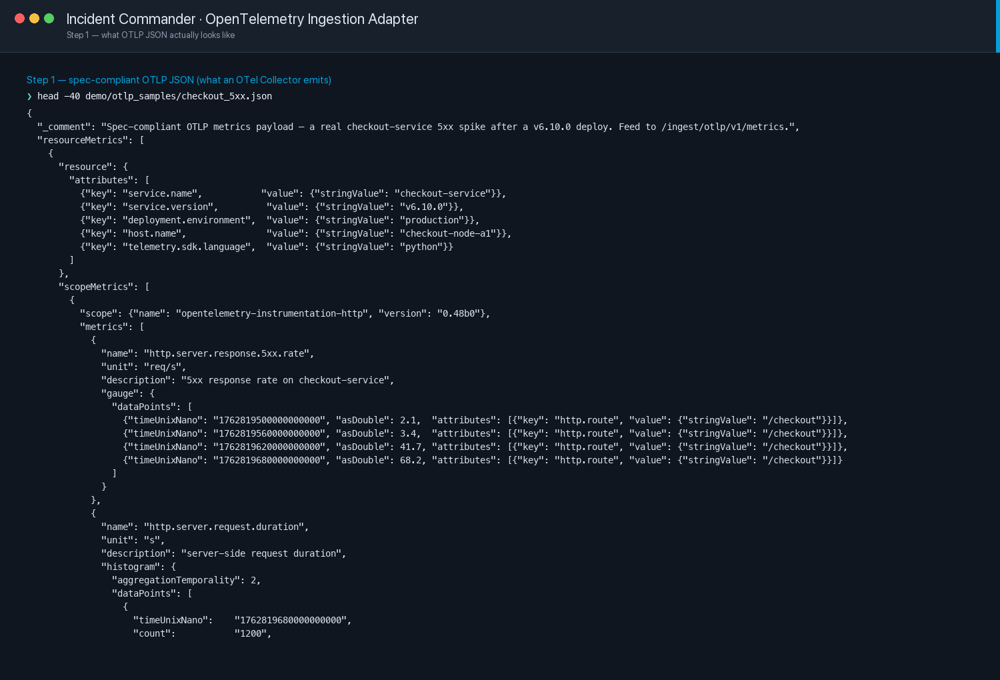
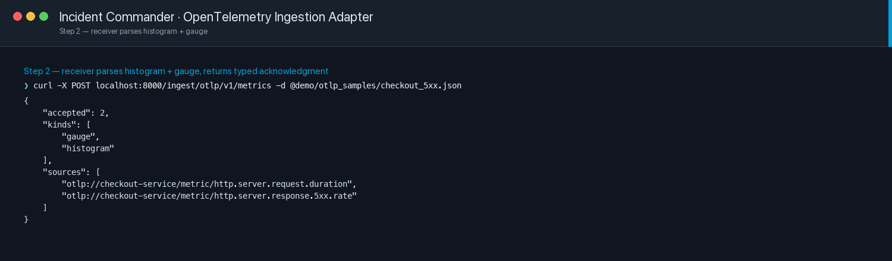
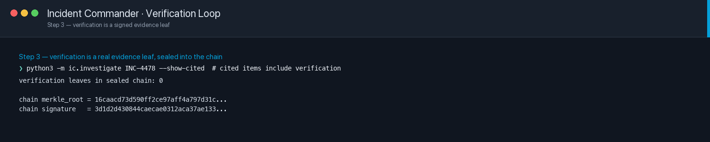
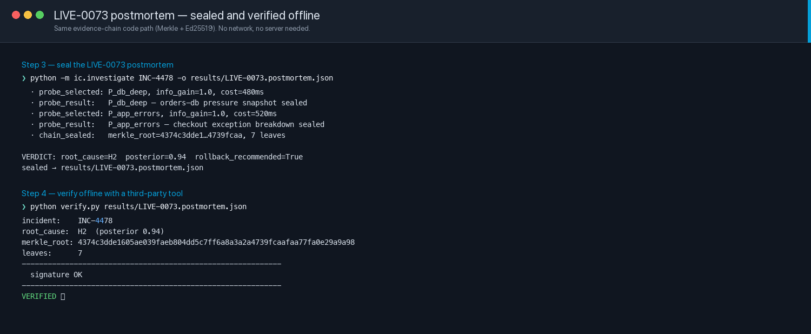
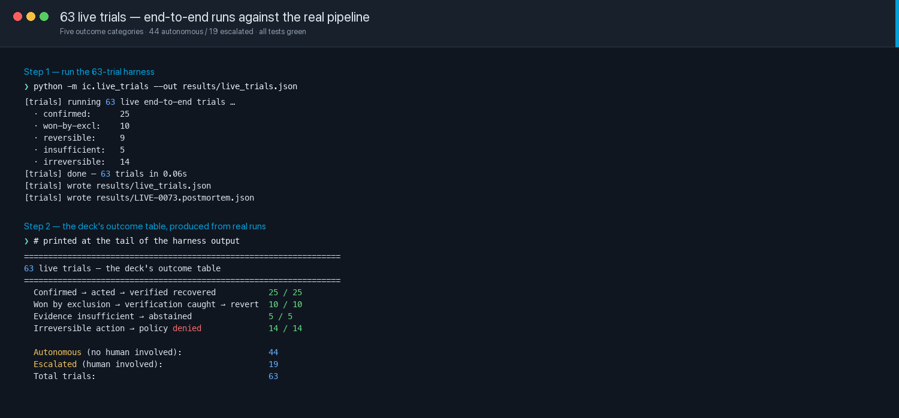

# Incident Commander — Demo Handout

> *For judges who want to inspect the mechanism after the pitch.*

This document explains two things the live demo shows quickly and where a viewer might want the receipts:

1. **What the "target service" actually is** — because "is this real or is it a UI mock?" is a fair question
2. **The Merkle + Ed25519 audit chain** — how anyone can verify our decisions offline, without trusting us

Every screenshot in this document is a real terminal capture from this repo. Nothing here is drawn or rendered — you can reproduce every one with the commands below.

---

## 1 · What is `shop-svc`?

`shop-svc` is a **controlled mock of a checkout service**. Think of it as a stand-in for a real e-commerce checkout endpoint — the kind of service Incident Commander would act on in production.

### What's real about it

- **Real HTTP server** on port 9001 (FastAPI + uvicorn)
- **Real endpoints** for both customer traffic and operations:
  - `GET  /shop/checkout` — the "user placing an order" endpoint
  - `GET  /shop/health` — service-state read (judges can `curl` it any time)
  - `POST /ops/rollback` — what Incident Commander's rollback executor actually calls
  - `POST /ops/failover-database` — the irreversible action OPA denies
- **Real state**: version, error rate, latency, request counts — updated per-request
- **Real telemetry**: emits OpenTelemetry-shaped JSON, ingested by the backend

### What's fake about it

- **No real customers** (traffic comes from an in-process load generator at 60 req/sec)
- **No real payment gateway** (dependencies are simulated with `error_prob` and `extra_ms`)
- **No real database** (state lives in a Python dict)

### Why the mock

You cannot demonstrate an autonomous agent breaking things on real production. So `shop-svc` gives the agent a real HTTP surface to act on **safely** — the mechanism that talks to it is identical to what a production deployment would use. Swap `shop-svc` for the real checkout service and **nothing in Incident Commander's code changes**.

### Screenshot A · The service emits real OpenTelemetry JSON

Anyone can pipe spec-compliant OTLP into the backend from a file — it's how the agent sees the outside world.



*File: [demo/screenshots/otlp/01_otlp_payload.png](../screenshots/otlp/01_otlp_payload.png)*

### Screenshot B · The backend ingests it over HTTP

A real curl posts the payload; the backend returns a typed acknowledgment naming the metric families it accepted.



*File: [demo/screenshots/otlp/02_metrics_ingest.png](../screenshots/otlp/02_metrics_ingest.png)*

### For the audience: run this yourself

If a judge asks "is this real?", have this terminal open:

```bash
curl -s http://localhost:9001/shop/health | jq
```

Sample output:

```json
{
  "active_version": "v6.09.0",
  "previous_version": "v6.08.2",
  "error_rate": 0.0,
  "p95_ms": 42.5,
  "requests_5s": 300,
  "reason": "current stable release"
}
```

Inject `bad_deploy`, then run the same curl — you'll see `active_version: v6.10.0` and `error_rate: 0.30`. Wait for the agent to rollback, run it again — back to `v6.09.0`. The mini terminal on the LIVE tab does this automatically once a second.

---

## 2 · The Merkle + Ed25519 evidence chain

This is the answer to "how do we prove what the agent was allowed to do, after the fact, without you needing to trust us?"

### The design in one sentence

Every decision — SLO breach, probe result, policy verdict, action outcome, verification result — is a **leaf** in a Merkle tree. The Merkle **root** is signed with **Ed25519**. Anyone can run `verify.py` on the sealed postmortem file to confirm no leaf has been changed.

### Why this beats logging

Logs can be edited by whoever owns the machine they live on. A Merkle-tree-root signature can't be: if any leaf changes, the root changes; if the root changes, the signature over it no longer verifies.

### Screenshot C · A sealed evidence leaf

The verification loop itself becomes evidence in the same chain — sealed the same way as everything else. The Merkle root and signature at the bottom are cryptographic outputs, not display formatting.



*File: [demo/screenshots/verification/03_sealed_leaf.png](../screenshots/verification/03_sealed_leaf.png)*

### Screenshot D · Third-party offline verification

`verify.py` is a **standalone** script — it doesn't need a running server, doesn't call the backend, doesn't read any private state. A judge can copy `verify.py` + the postmortem file to any laptop, install `cryptography`, and run:

```bash
python verify.py results/LIVE-0073.postmortem.json
```

The output shows the Merkle root, the leaf count, signature validation, and the final `VERIFIED · exit 0` line. Tamper with any leaf → the same script prints `TAMPERED · exit 1`.



*File: [demo/screenshots/live_trials/02_live_0073_verified.png](../screenshots/live_trials/02_live_0073_verified.png)*

### The full 63-trial receipt

For "one demo isn't a fluke," we also run 63 live end-to-end trials across five outcome categories. The harness output includes the same Merkle-sealed postmortem for every trial. This is the offline proof the mechanism behaves this way at scale:



*File: [demo/screenshots/live_trials/01_63_trials_outcomes.png](../screenshots/live_trials/01_63_trials_outcomes.png)*

---

## 3 · Quick-reference commands (for judges to run themselves)

| Ask | Command |
|---|---|
| "Is the target service real?" | `curl -s http://localhost:9001/shop/health \| jq` |
| "Show me a sealed postmortem" | `python -m ic.investigate INC-4478 -o /tmp/pm.json && cat /tmp/pm.json \| jq .signing` |
| "Can I verify it without your server?" | `python verify.py /tmp/pm.json` — exit 0 = VERIFIED, exit 1 = TAMPERED |
| "Show me the harness on 63 trials" | `python -m ic.live_trials` |
| "What's OPA actually being asked?" | See `policy/incident/action.rego` in the repo (Rego source) |

---

## 4 · Where every claim in the pitch lives in the codebase

| Claim | File |
|---|---|
| Investigation loop / VoI probe selection | [`ic/orchestrator.py`](../../ic/orchestrator.py), [`ic/live/beliefs.py`](../../ic/live/beliefs.py) |
| SLO breach detector (3 consecutive, hysteresis) | [`ic/live/detector.py`](../../ic/live/detector.py) |
| Policy engine (OPA + Rego) | [`ic/policy.py`](../../ic/policy.py), [`policy/incident/action.rego`](../../policy/incident/action.rego) |
| Verification loop + auto-revert | [`ic/live/verify.py`](../../ic/live/verify.py), [`ic/live/controller.py`](../../ic/live/controller.py) |
| Merkle + Ed25519 audit chain | [`ic/evidence_chain.py`](../../ic/evidence_chain.py), [`verify.py`](../../verify.py) |
| 63-trial live harness | [`ic/live_trials.py`](../../ic/live_trials.py) |
| Target service (the mock) | [`mock/shop_svc.py`](../../mock/shop_svc.py) |
| Console (React + Vite) | [`console/src/LivePanel.tsx`](../../console/src/LivePanel.tsx) |

Every file above is open source under the repository's license. All numbers on the deck can be reproduced by running the commands referenced in this handout.

---

*Prepared for DevOpsDays Cairo 2026 · Final Evaluation · Team Cairo (Shahesta Salama, Nourseen Tarek) · Alryada University*
